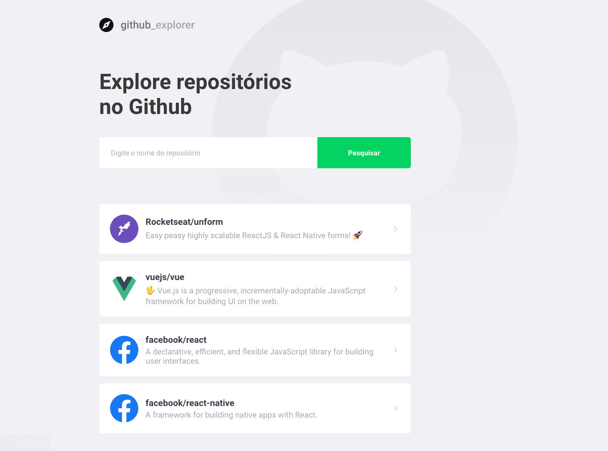
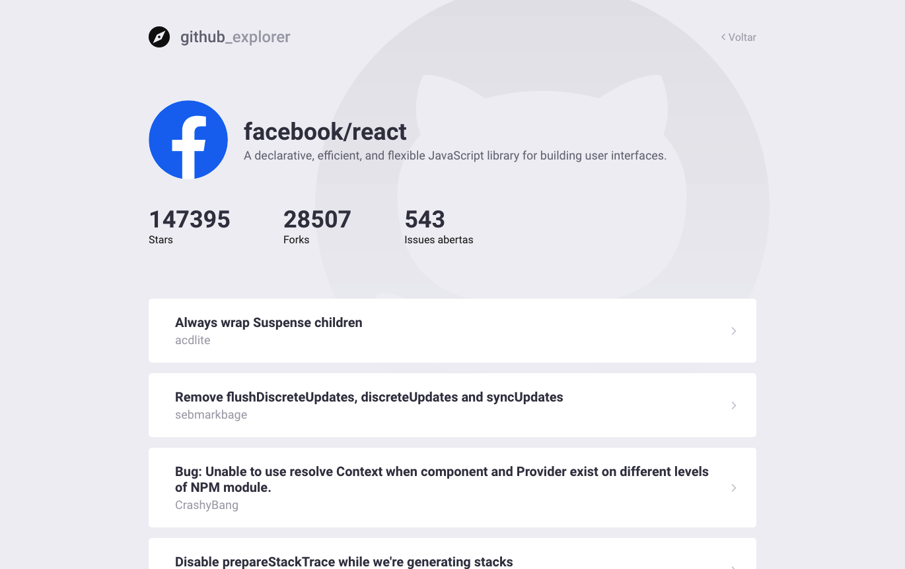

<h1 align="center">
    
</h1>

<h3 align="center">
  Github Explorer - Projeto criado com React JS durante o Bootcamp GoStack.
</h3>

<p align="center">
  <a href="#rocket-sobre-a-aplicação">Sobre a Aplicação</a>&nbsp;&nbsp;&nbsp;|&nbsp;&nbsp;&nbsp;
  <a href="#conteúdo-abordado">Conteúdo Abordado</a>&nbsp;&nbsp;&nbsp;|&nbsp;&nbsp;&nbsp;
  <a href="#instalação">Instalação</a>&nbsp;&nbsp;&nbsp;|&nbsp;&nbsp;&nbsp;
  <a href="#executando-a-aplicação">Executando a Aplicação</a>&nbsp;&nbsp;&nbsp;|&nbsp;&nbsp;&nbsp;
  <a href="#executando-os-testes-da-aplicação">Executando os Testes da Aplicação</a>&nbsp;&nbsp;&nbsp;|&nbsp;&nbsp;&nbsp;
  <a href="#tela-da-aplicação">Tela da Aplicação</a>&nbsp;&nbsp;&nbsp;|&nbsp;&nbsp;&nbsp;
  <a href="#memo-licença">Licença</a>
</p>

## :rocket: Sobre a Aplicação

O Github Explorer é uma aplicação criada com React JS que permite criar uma lista com os repositórios do Github favoritos, permitindo visualizar alguns detalhes do repositório como nome do dono do repositório, descrição, quantidade de stars, forks, issues e visualizar as issues/pull requests realizados.

## Conteúdo Abordado na Criação da Aplicação

- Criando projeto;
- EditorConfig;
- ESLint;
- Prettier;
- Criando Rotas;
- Utilizando Styled Components;
- Conectando a API;
- Lidando com erros;
- Salvando no Storage;
- Navegando entre rotas.

## Instalação

Instalação das dependências do projeto.

```sh
# Com NPM
npm install

# Com Yarn
yarn
```

## Executando a Aplicação

```sh
# Com NPM
npm run start

# Com Yarn
yarn start
```

## Tela da Aplicação

### Listagem de Repositórios



### Detalhe de um Repositório



## :memo: Licença

Esse projeto está sob a licença MIT. Veja o arquivo [LICENSE](LICENSE.md) para mais detalhes.
